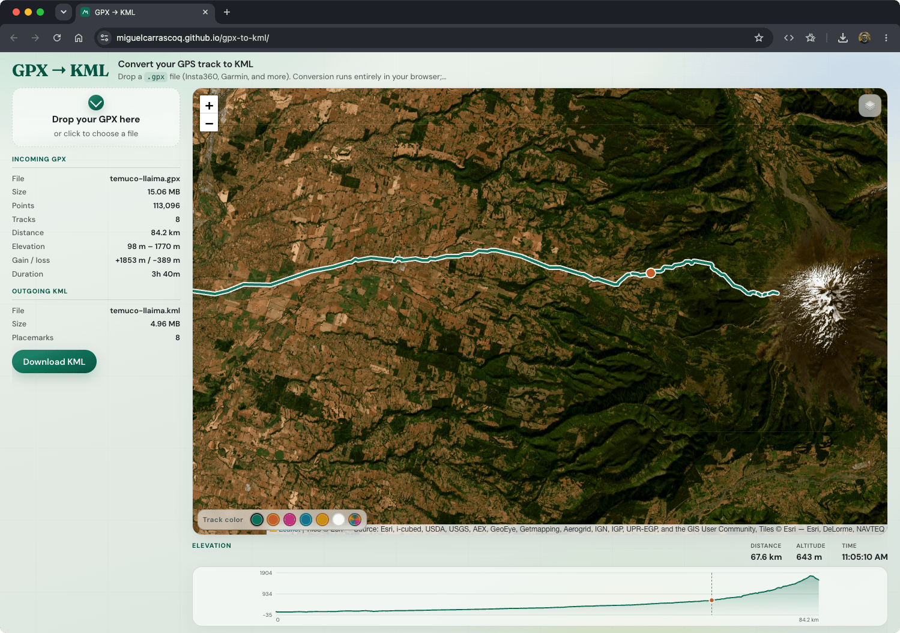

# GPX → KML

Convert GPX files to KML in your browser. No server: the file never leaves your device.



## Usage

1. Open [https://miguelcarrascoq.github.io/gpx-to-kml/](https://miguelcarrascoq.github.io/gpx-to-kml/)
2. Drop a `.gpx` file, pick one with the file chooser, or try the sample track (Temuco → Llaima) from `public/examples/`
3. Review track stats, the map preview, and the elevation profile
4. Download the generated `.kml`

Works with Insta360 Studio, Garmin, and other GPX 1.0/1.1 exporters (tracks, routes, and waypoints). After loading a file, an interactive map preview (Streets, Satellite, Hybrid, Topographic — no API key) and elevation scrubber show the track.

## Local development

```bash
npm install
npm run dev
```

Open the URL Vite prints (default `http://localhost:5173/gpx-to-kml/`).

```bash
npm run build
```

## License

MIT
